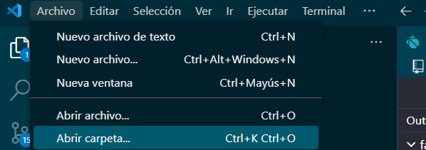

# flutter_internals

Aplicación para aprender más acerca de los uuid y realización de filtros de forma ascendente y descendiente y utilización de keys .


## Descarga e instalación.

Ejecutar los siguientes comandos.

Paso 1: Clonar el repositorio.

```nginx
git clone https://github.com/LuisFer27/flutter_internals.git

```

Paso 2 :Abrir visual studio code.


Paso 3 seleccionar la carpeta en donde se guardo el repositorio en la opción  archivo y abrir carpeta.



se selecciona la carpeta en donde esta ubicado el repositorio ya que en este caso esta almacenado en documentos pero puede variar según el lugar en de lo tengas descargado.


Paso 4  una vez abierta la carpeta nos apareceran todas estas carpetas sin embargo la que nos interesa es la de lib en donde se alamcena todo los archivos dart para la ejecución de la aplicación.


Paso 5 abriremos la carpeta lib y nos dirigiremos al archivo main .dart.


abrimos el archivo main.dart y se nos visualizara de esta forma ya que aquí al ser la primera aplicación que se trabajo en fluter se simplifco todo para que solo funcionara a partir de aqui ya que en routes especificamente en la carpeta templates se encuentra el archivo donde esta la función.

```dart
import 'package:flutter/material.dart';
//import 'package:flutter_internals/ui_updates_demo.dart';
import 'package:flutter_internals/keys/keys.dart';

void main() {
  //var numbers = [1, 2, 3];
  //numbers = [4, 5, 6];
  //numbers.add(4);
  runApp(const MyApp());
}

class MyApp extends StatelessWidget {
  const MyApp({super.key});

  @override
  Widget build(BuildContext context) {
    return MaterialApp(
      theme: ThemeData(useMaterial3: true),
      home: Scaffold(
        appBar: AppBar(
          title: const Text('Flutter Internals'),
        ),
        //body: const UIUpdatesDemo(),
        body: const Keys(),
      ),
    );
  }
}

```

en este caso en el editor le daremos click en run.


depende del dispositivo que dispongamos este se ejecutar si no podemos cambiarlo abajo de nuestro editor .


y escoger nuestro dispositivo principalmente movil ya que en este caso podemos seleccionar movil o virtual como en este ejemplo.


## Funcionalidad.


Pantalla principal aqui se observa un listado con check list al igual el botón que permite ordenar el apartado ya que esto es para practica empleando los uuid y keys.
